# SC-200: Microsoft Security Operations Analyst - MS-Learn notes

## Index

- [SC-200: Microsoft Security Operations Analyst - MS-Learn notes](#sc-200-microsoft-security-operations-analyst---ms-learn-notes)
  - [Index](#index)
  - [Introduction](#introduction)
    - [References](#references)
  - [Abbreviations](#abbreviations)
  - [Mitigate threats using Microsoft 365 Defender](#mitigate-threats-using-microsoft-365-defender)
    - [Introduction to Microsoft 365 threat protection](#introduction-to-microsoft-365-threat-protection)
      - [Security Operations Model](#security-operations-model)
      - [Interactive Guide: Investigate security incident in Microsoft 365 Defender](#interactive-guide-investigate-security-incident-in-microsoft-365-defender)
    - [Mitigate incidents using Microsoft 365 Defender](#mitigate-incidents-using-microsoft-365-defender)
      - [Microsoft Defender products](#microsoft-defender-products)
      - [Required roles and permissions](#required-roles-and-permissions)
      - [Lab simulation: Explore Microsoft 365 Defender](#lab-simulation-explore-microsoft-365-defender)
      - [Alert Categories](#alert-categories)
      - [Automated investigation](#automated-investigation)
        - [Investigation details](#investigation-details)
        - [Remediation action: automation levels](#remediation-action-automation-levels)
      - [Advanced Hunting](#advanced-hunting)
        - [Custom detections](#custom-detections)
      - [Analyze threat analytics](#analyze-threat-analytics)
        - [Currently available threat tags](#currently-available-threat-tags)
      - [Reports](#reports)
        - [General](#general)
        - [Endpoints](#endpoints)
        - [Email \& Collaboration](#email--collaboration)
    - [Protect your identites with Azure AD Identity Protection](#protect-your-identites-with-azure-ad-identity-protection)
      - [Risks](#risks)
        - [User risk](#user-risk)
        - [Sign-in risk](#sign-in-risk)
      - [Azure Active Directory Identity Protection workflow](#azure-active-directory-identity-protection-workflow)
        - [Self-remediation workflow](#self-remediation-workflow)
        - [Administrator remediation workflow](#administrator-remediation-workflow)
      - [Azure AD Identity Protection policies](#azure-ad-identity-protection-policies)
    - [Microsoft Defender for Office 365](#microsoft-defender-for-office-365)
      - [Save time with automated investigation and response](#save-time-with-automated-investigation-and-response)
      - [Safe Attachments](#safe-attachments)
      - [Safe Links](#safe-links)
      - [Anti-phishing policies](#anti-phishing-policies)
    - [Microsoft Defender for Identity](#microsoft-defender-for-identity)
      - [Configure Microsoft Defender for Identity sensors](#configure-microsoft-defender-for-identity-sensors)
      - [Microsoft Defender for Identity Architecture](#microsoft-defender-for-identity-architecture)
      - [Integrate with other Microsoft tools](#integrate-with-other-microsoft-tools)
    - [Secure your cloud apps and services with Microsoft Defender for Cloud Apps](#secure-your-cloud-apps-and-services-with-microsoft-defender-for-cloud-apps)

## Introduction

This markdown file contains my personal notes from the Microsoft Learn modules for SC-200: Microsoft Security Operations Analyst.
My goal is to pass the SC-200 exam to become ***Microsoft Certified: Security Operations Analyst Associate***

I started studying for this exam on Sunday, June 11th 2023.

### References

- [Microsoft Certified: Security Operations Analyst Associate | Microsoft Learn](https://learn.microsoft.com/en-us/certifications/security-operations-analyst/)
- [Exam SC-200: Microsoft Security Operations Analyst](https://learn.microsoft.com/en-us/certifications/exams/sc-200/)
- [My public transcript on Microsoft Learn](https://learn.microsoft.com/en-us/users/marcojanse/transcript/7k22pag19y113p2)

## Abbreviations

The following abbreviations are very useful to know for this exam

| **Abbreviation** | **Details**                               |
|------------------|-------------------------------------------|
| XDR              | Extended Detection & Response             |
| SIEM             | Security Information and Event Management |
| SOC              | Security Operations Center                |
| MDO              | Microsoft Defender for Office             |
| MDE              | Microsoft Defender for Endpoints          |
| PUA              | Potentially Unwanted Application          |

## Mitigate threats using Microsoft 365 Defender

### Introduction to Microsoft 365 threat protection

Below is a visual representation of detection and mitigation use cases

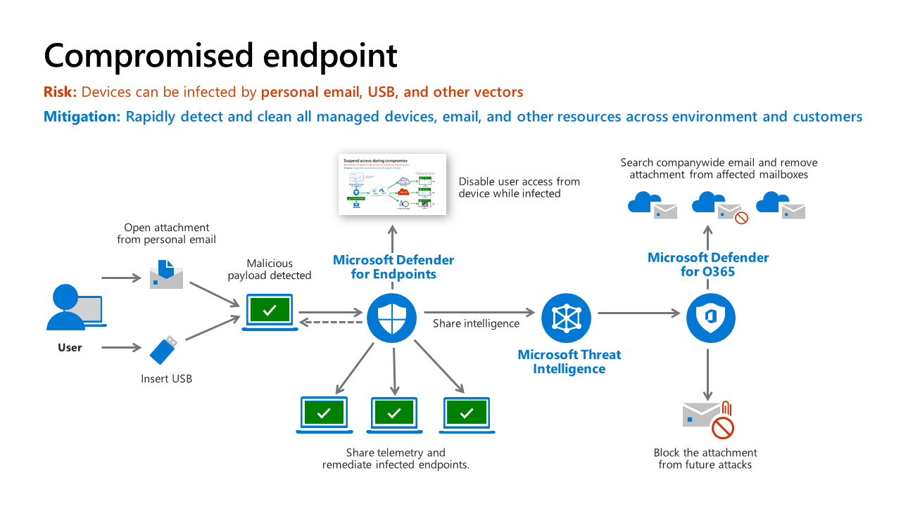

Zoom in to MDE - suspend access during compromised phase

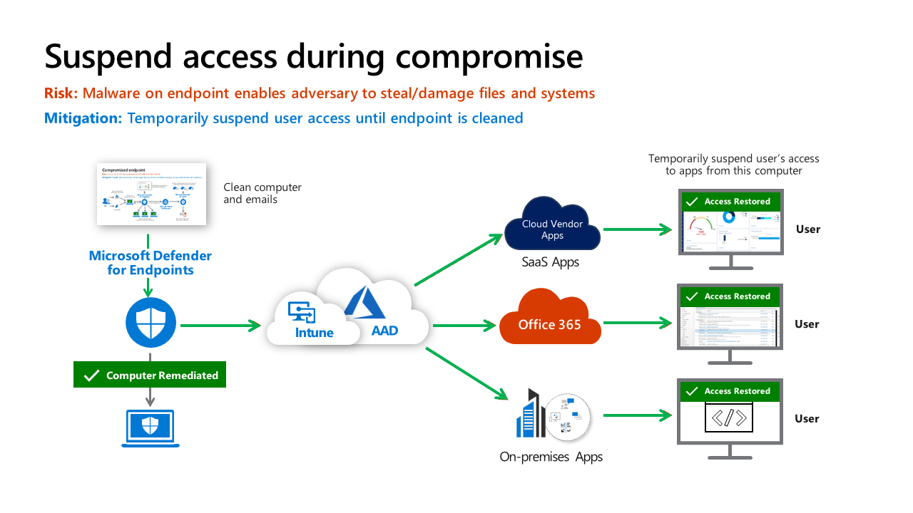

#### Security Operations Model

The following Tiers are used in a Security Operations Model

- Automation
- Tier 1: Triage
- Tier 2: Investigation
- Tier 3: Hunt

See the below graph for the tasks of each team.

Below is an example of an incident lifecycle

1. Triage (Tier 1) analyst claims a malware alert from the queue and investigates (for example, with Microsoft 365 Defender console) 
2. While most Triage cases are rapidly remediated and closed, this time the analyst observes that malware may require more involved/advanced remediation (for example, device isolation and cleanup). Triage escalates the case to the Investigation analyst (Tier 2), who takes lead for investigation. The Triage team has option to stay involved and learn more (Investigation team may use Microsoft Sentinel or another SIEM for broader context)
3. Investigation verifies investigation conclusions (or digs further into it) and proceeds with remediation, closes case.
4. Later, Hunt (Tier 3) may notice this case while reviewing closed incidents to scan for commonalities or anomalies worth digging into:

- Detections that may be eligible for auto-remediation
- Multiple similar incidents that may have a common root cause
- Other potential process/tool/alert improvements In one case, Tier 3 reviewed the case and found that the user had fallen for a tech scam. This detection was then flagged as a potentially higher priority alert because the scammers had managed to get admin level access on the endpoint. A higher risk exposure.

#### Interactive Guide: Investigate security incident in Microsoft 365 Defender

The following cloud guide demonstrates Microsoft 365 Defender and Microsoft Sentinel working together to investigate a security incident in a hybrid environment.

[Launch Interactive Guide: Investigate security incident in Microsoft 365 Defender](https://mslearn.cloudguides.com/guides/Investigate%20security%20incidents%20in%20a%20hybrid%20environment%20with%20Azure%20Sentinel)

### Mitigate incidents using Microsoft 365 Defender

#### Microsoft Defender products

- **Microsoft Defender for Office 365** - Microsoft Defender for Office 365 helps organizations secure their enterprise with a set of prevention, detection, investigation and hunting features to protect email, and Office 365 resources.
- **Microsoft Defender for Endpoint** - delivers preventative protection, post-breach detection, automated investigation, and response for devices in your organization.
- **Microsoft 365 Defender** - is part of Microsoft’s Extended Detection and Response (XDR) solution that uses the Microsoft 365 security portfolio to automatically analyze threat data across domains, and build a picture of an attack on a single dashboard.
- **Microsoft Defender for Cloud Apps** - is a comprehensive cross-SaaS and PaaS solution bringing deep visibility, strong data controls, and enhanced threat protection to your cloud apps.
- **Microsoft Defender for Identity** - is a cloud-based security solution that uses your on-premises Active Directory signals to identify, detect, and investigate advanced threats, compromised identities, and malicious insider actions directed at your organization.
- **Microsoft Defender Vulnerability Management** - delivers continuous asset visibility, intelligent risk-based assessments, and built-in remediation tools to help your security and IT teams prioritize and address critical vulnerabilities and misconfigurations across your organization.

#### Required roles and permissions

| **One of the following roles is required for Microsoft 365 Defender**                                | **One of the following roles is required for Defender for Endpoint**                                                             | **One of the following roles is required for Defender for Office 365**                                                                                                                                                                                                               | **One of the following roles is required for Defender for Cloud Apps**                                   |
|------------------------------------------------------------------------------------------------------|----------------------------------------------------------------------------------------------------------------------------------|--------------------------------------------------------------------------------------------------------------------------------------------------------------------------------------------------------------------------------------------------------------------------------------|----------------------------------------------------------------------------------------------------------|
| Viewing investigation data: - Alert page - Alerts queue - Incidents - Incident queue - Action center | View data-security operations                                                                                                    | - View-only Manage alerts - Organization - configuration - Audit logs - View-only audit logs - Security reader - Security admin - View-only recipients                                                                                                                               | - Global admin - Security admin - Compliance admin - Security operator - Security reader - Global reader |
| Viewing hunting data                                                                                 | View data-security operations                                                                                                    | - Security reader - Security admin - View-only recipients                                                                                                                                                                                                                            | - Global admin - Security admin - Compliance admin - Security operator - Security reader - Global reader |
| Managing alerts and incidents                                                                        | Alerts investigation                                                                                                             | - Manage alerts - Security admin                                                                                                                                                                                                                                                     | - Global admin - Security admin - Compliance admin - Security operator - Security reader                 |
| Action center remediation                                                                            | Active remediation actions – security operations                                                                                 | Search and purge                                                                                                                                                                                                                                                                     |                                                                                                          |
| Setting custom detections                                                                            | Manage security settings                                                                                                         | - Manage alerts - Security admin                                                                                                                                                                                                                                                     | - Global admin - Security admin - Compliance admin - Security operator - Security reader - Global reader |
| Threat Analytics                                                                                     | Alerts and incidents data: - View data - security operations  TVM mitigations: - View data - Threat and vulnerability management | Alerts and incidents data: - View-only Manage alerts - Manage alerts - Organization configuration - Audit logs - View-only audit logs - Security reader - Security admin - View-only recipients  Prevented email attempts: - Security reader - Security admin - View-only recipients | Not available for Defender for Cloud Apps or MDI users                                                   |

#### Lab simulation: Explore Microsoft 365 Defender

[Start interactive lab simulation: Explore Microsoft 365 Defender](https://mslabs.cloudguides.com/guides/SC-200%20Lab%20Simulation%20-%20Explore%20Microsoft%20365%20Defender)

#### Alert Categories

The alert categories align with the enterprise attack tactics in the [MITRE ATT&CK matrix](https://attack.mitre.org/matrices/enterprise/). The categories are:

- **Collection** - Locating and collecting data for exfiltration
- **Command and control** - Connecting to attacker-controlled network infrastructure to relay data or receive commands
- **Credential access** - Obtaining valid credentials to extend control over devices and other resources in the network
- **Defense evasion** - Avoiding security controls by, for example, turning off security apps, deleting implants, and running rootkits
- **Discovery** - Gathering information about important devices and resources, such as administrator computers, domain controllers, and file servers
- **Execution** - Launching attacker tools and malicious code, including RATs and backdoors
- **Exfiltration** - Extracting data from the network to an external, attacker-controlled location
- **Exploit** - Exploit code and possible exploitation activity
- **Initial access** - Gaining initial entry to the target network, usually involving password-guessing, exploits, or phishing emails
- **Lateral movement** - Moving between devices in the target network to reach critical resources or gain network persistence
- **Malware** - Backdoors, trojans, and other types of malicious code
- **Persistence** - Creating autostart extensibility points (ASEPs) to remain active and survive system restarts
- **Privilege escalation** - Obtaining higher permission levels for code by running it in the context of a privileged process or account
- **Ransomware** - Malware that encrypts files and extorts payment to restore access
- **Suspicious activity** - Atypical activity that could be malware activity or part of an attack
- **Unwanted software** - Low-reputation apps and apps that impact productivity and the user experience; detected as potentially unwanted applications (PUAs)

#### Automated investigation

When an alert is triggered, a security playbook goes into effect. Depending on the security playbook, an automated investigation can start.

##### Investigation details

- **Alerts** - The alert(s) that started the investigation
- **Devices** - The device(s) where the threat was seen.
- **Evidence** - The entities that were found to be malicious during an investigation.
- **Entities** - Details about each analyzed entity, including a determination for each entity type (Malicious, Suspicious, or No threats found).
- **Log** - The chronological, detailed view of all the investigation actions taken on the alert.
- **Pending actions** - If there are any actions awaiting approval as a result of the investigation, the Pending actions tab is displayed. On the Pending actions tab, you can approve or reject each action.

##### Remediation action: automation levels

- Full - remediate threats automatically (also referred to as full automation)
- Semi - require approval for any remediation (also referred to as semi-automation)
- Semi - require approval for non-temp folders remediation (also a type of semi-automation)

> Using the no automation option isn't recommended because it reduces the security posture of your organization's devices. Consider setting up your automation level to full automation (or at least semi-automation)

#### Advanced Hunting

Advanced hunting is a query-based threat-hunting tool that lets you explore up to 30 days of raw data. You can proactively inspect events in your network to locate threat indicators and entities. The flexible access to data enables unconstrained hunting for both known and potential threats.

[Demo: advanced hunting](https://www.microsoft.com/en-us/videoplayer/embed/RE4Bp7O?postJsllMsg=true)

Time information in advanced hunting is in the UTC zone

##### Custom detections

With custom detections, you can proactively monitor for and respond to various events and system states, including suspected breach activity and misconfigured endpoints. This is made possible by customizable detection rules that automatically trigger alerts and response actions.

Custom detections work with advanced hunting, which provides a powerful, flexible query language that covers a broad set of event and system information from your network. You can set them to run at regular intervals, generating alerts and taking response actions whenever there are matches.

Custom detections provide:

- Alerts for rule-based detections built from advanced hunting queries
- Automatic response actions that apply to files and devices

#### Analyze threat analytics

Threat analytics is a threat intelligence solution from expert Microsoft security researchers. It's designed to assist security teams to be as efficient as possible while facing emerging threats, such as:

- Active threat actors and their campaigns
- Popular and new attack techniques
- Critical vulnerabilities
- Common attack surfaces
- Prevalent malware

[Threat analytics video](https://www.microsoft.com/en-us/videoplayer/embed/RWwJfU?rel=0&postJsllMsg=true)

##### Currently available threat tags

- Ransomware
- Phishing
- Vulnerability
- Activity group

#### Reports

##### General

| Name            | Description                                                                                                                         |
|-----------------|-------------------------------------------------------------------------------------------------------------------------------------|
| Security report | View information about security trends and track the protection status of your identities, data, devices, apps, and infrastructure. |

##### Endpoints

| **Name**                       | **Description**                                                                                                                                                   |
|--------------------------------|-------------------------------------------------------------------------------------------------------------------------------------------------------------------|
| Threat protection              | See details about the security detections and alerts in your organization.                                                                                        |
| Device health and compliance   | Monitor the health state, antivirus status, operating system platforms, and Windows 10 versions for devices in your organization.                                 |
| Vulnerable devices             | View information about the vulnerable devices in your organization, including their exposure to vulnerabilities by severity level, exploitability, age, and more. |
| Web protection                 | Get information about the web activity and web threats detected within your organization.                                                                         |
| Firewall                       | View connections blocked by your firewall including related devices, why they were blocked, and which ports were used                                             |
| Device control                 | This report shows your organization's media usage data.                                                                                                           |
| Attack surface reduction rules | View information about detections, misconfiguration, and suggested exclusions in your environment.                                                                |

##### Email & Collaboration

| **Name**                      | **Description**                                                                                              |
|-------------------------------|--------------------------------------------------------------------------------------------------------------|
| Email & collaboration reports | Review Microsoft recommended actions to help improve email and collaboration security.                       |
| Manage schedules              | Manage the schedule for the reports security teams use to mitigate and address threats to your organization. |
| Reports for download          | Download one or more of your reports.                                                                        |
| Exchange mail flow reports    | Deep link to Exchange mail flow report in the Exchange admin center.                                         |

### Protect your identites with Azure AD Identity Protection

Identity Protection is a solution built into Azure AD that's designed to protect your identities through a three-part process.
It requires Azure AD Premium P2 licenses. (included in E5 for example)

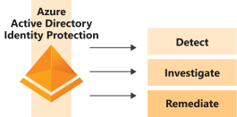

#### Risks

Risks are categorized in two ways: as user risks and sign-in risks. User risks can be described as suspicious activity and actions by users when they sign in, and sign-in risks as actions that users take after signing in.

##### User risk

A user risk is caused when a user's identity or account is compromised. User risks can include:

| **Risk**           | **Description**                                                                                                                                                             |
|--------------------|-----------------------------------------------------------------------------------------------------------------------------------------------------------------------------|
| Unusual behavior   | The account showed unusual activity or the patterns of usage are similar to those patterns that Microsoft systems and experts have identified as attacks.                   |
| Leaked credentials | The user's credentials could have been leaked. For example, Microsoft might have found a list of leaked credentials on the dark web, which could affect your user accounts. |

##### Sign-in risk

Here, Identity Protection scrutinizes each authentication request to judge whether the owner of the identity authorized it. Sign-in risks can include:

| **Risk**                      | **Description**                                                                                                                                                                              |
|-------------------------------|----------------------------------------------------------------------------------------------------------------------------------------------------------------------------------------------|
| Unfamiliar sign-in properties | Identity Protection remembers and learns a particular user's sign-in history. For example, when a sign-in occurs from a location that's unusual for the user, a risk detection is triggered. |
| Atypical travel               | For example, when two or more sign-ins occur from distant locations in an unrealistically short time period, a risk detection is raised.                                                     |
| Malware-linked IP address     | For example, if it's known that the IP address where the sign-in originates has been in contact with an active bot server, a risk detection is raised.                                       |
| Anonymous IP address          | For example, a sign-in originates from an anonymous IP address. Because attackers can use these details to hide their real IP address or location, a risk detection is raised.               |

#### Azure Active Directory Identity Protection workflow

##### Self-remediation workflow

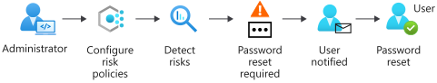

##### Administrator remediation workflow

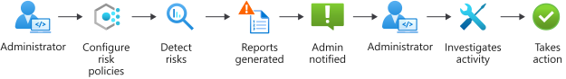

#### Azure AD Identity Protection policies

Example of a configured risk policy:

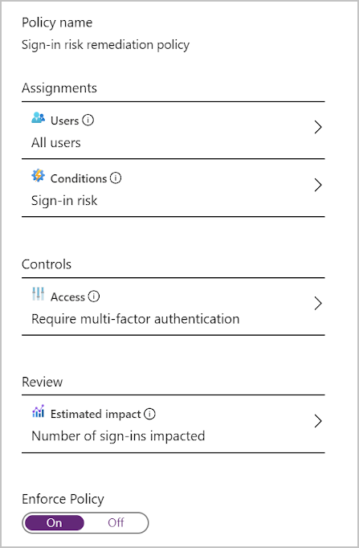

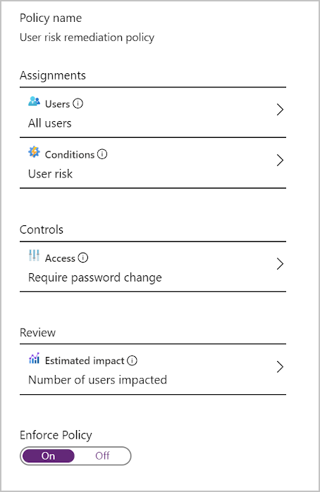

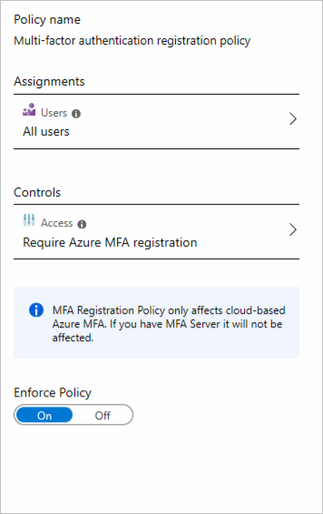

### Microsoft Defender for Office 365

Microsoft Defender for Office 365 is a cloud-based email filtering service that helps protect your organization against unknown malware and viruses by providing robust zero-day protection. It includes features to safeguard your organization from harmful links in real time. Microsoft Defender for Office 365 has rich reporting and URL trace capabilities that give administrators insight into the kind of attacks happening in your organization.

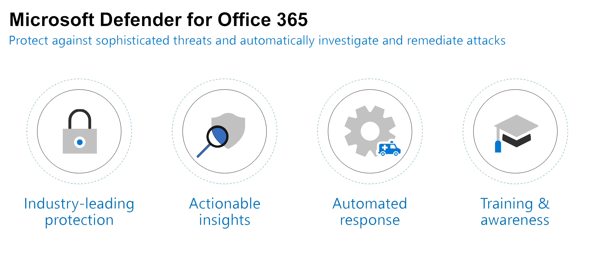

#### Save time with automated investigation and response

**Automated investigation and response (AIR)** capabilities include a set of security playbooks that can be launched automatically, such as when an alert is triggered, or manually, such as from a view in Explorer. AIR can save your security operations team time and effort in mitigating threats effectively and efficiently.

#### Safe Attachments

Microsoft Defender for Office 365 Safe Attachments protects against unknown malware and viruses, and provides zero-day protection to safeguard your messaging system. All messages and attachments that don't have a known virus/malware signature are routed to a special environment where Microsoft Defender for Office 365 uses various machine learning and analysis techniques to detect malicious intent. If no suspicious activity is detected, the message is released for delivery to the mailbox.

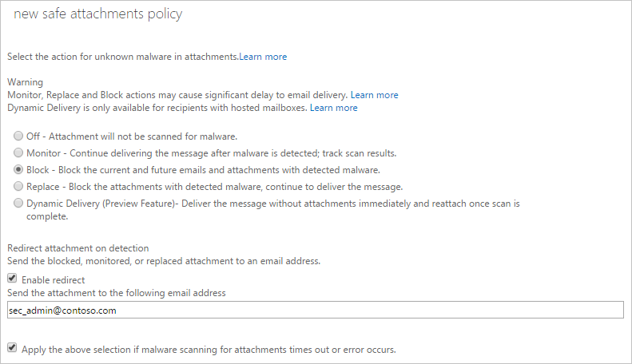

#### Safe Links

The Microsoft Defender for Office 365 Safe Links feature proactively protects your users from malicious URLs in a message or in an Office document. The protection remains every time they select the link, as malicious links are dynamically blocked while good links can be accessed.

Safe Links is available for URLs in the following apps:

- Microsoft 365 apps for enterprise on Windows or Mac
- Office for the web (Word for the web, Excel for the web, PowerPoint for the web, and OneNote for the web)
- Word, Excel, PowerPoint, and Visio on Windows, as well as Office apps on iOS and Android devices
- Microsoft Teams channels and chats

#### Anti-phishing policies

Microsoft Defender for Office 365 anti-phishing checks incoming messages for indicators that a message might be a phishing attempt. When users are covered by Microsoft Defender for Office 365 policies (Safe Attachments, Safe Links, or anti-phishing), incoming messages are evaluated by multiple machine learning models that analyze messages. The appropriate action is taken, based on the configured policies.

There's no default Microsoft Defender for Office 365 anti-phishing policy. When you're creating one, only targeting is originally configured. Impersonation settings play a large role in Microsoft Defender for Office 365 anti-phishing policies. Impersonation is where the sender or the sender's email domain in a message looks similar to a real sender or domain:

An example impersonation of the domain `contoso.com` is `ćóntoso.com.`
An example impersonation of the user `michelle@contoso.com` is `michele@contoso.com.`

### Microsoft Defender for Identity

Microsoft Defender for Identity is a cloud-based security solution that leverages your on-premises Active Directory signals to identify, detect, and investigate advanced threats, compromised identities, and malicious insider actions directed at your organization.

Therefore, you need to install an sensor agent on your DC's.

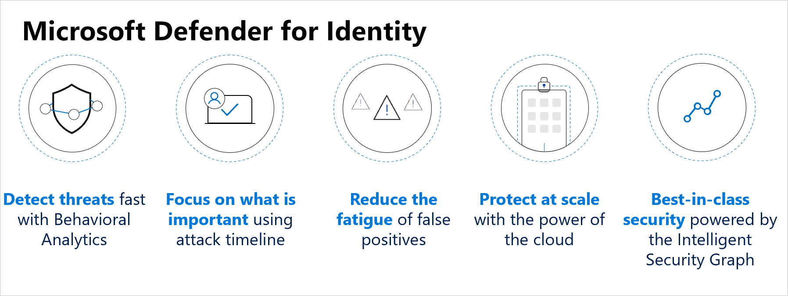

> Microsoft Defender for Identity requires one of the following licenses:
>
> - EMS E5/A5
> - Microsoft 365 E5/A5/G5
> - Microsoft 365 E5/A5/G5/F5 Security
> - Microsoft F5 Security & Compliance
> - Microsoft Defender for Identity for Users

Microsoft Defender for Identity provides the following benefits:

- Monitor users, entity behavior, and activities with learning-based analytics
- Protect user identities and credentials stored in Active Directory
- Identify and investigate suspicious user activities and advanced attacks throughout the kill chain
- Provide clear incident information on a simple timeline for fast triage

#### Configure Microsoft Defender for Identity sensors

At a high level, the following steps are required to enable Microsoft Defender for Identity:

- Create an instance on Microsoft Defender for Identity management portal.
- Specify an on-premises AD service account in the Microsoft Defender for Identity portal.
- Download and install the sensor package.
- Install the Microsoft Defender for Identity sensor on all domain controllers.
- Integrate your VPN solution (optional).
- Exclude the sensitive accounts you've listed during the design process.
- Configure the required permissions for the sensor to make SAM-R calls.
- Configure integration with Microsoft Defender for Cloud Apps.
- Configure integration with Microsoft 365 Defender (optional).

#### Microsoft Defender for Identity Architecture

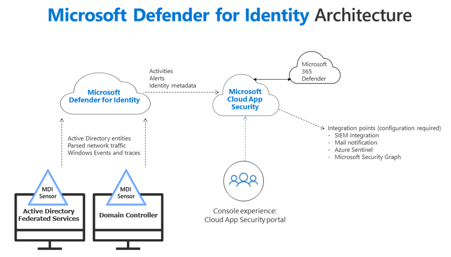

Installed directly on your domain controllers, the Microsoft Defender for Identity sensor accesses the event logs it requires directly from the domain controller. After the logs and network traffic are parsed by the sensor, Microsoft Defender for Identity sends only the parsed information to the Microsoft Defender for Identity cloud service (only a percentage of the logs are sent).

#### Integrate with other Microsoft tools

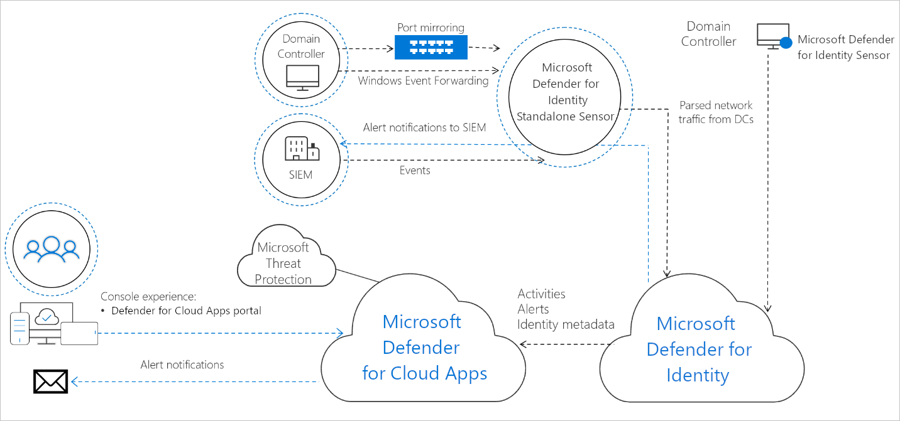

### Secure your cloud apps and services with Microsoft Defender for Cloud Apps

> Pick up from [here](https://learn.microsoft.com/en-us/training/modules/microsoft-cloud-app-security/cloud-app-security-framework)