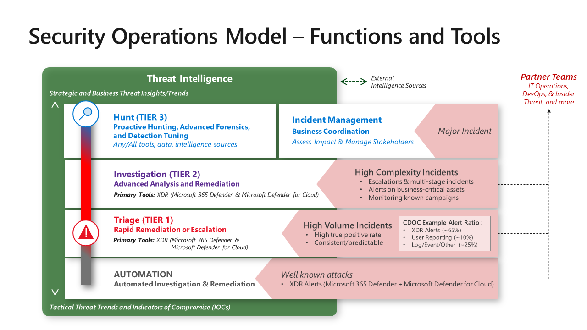

# SC-200: Microsoft Security Operations Analyst - MS-Learn notes

## Index

- [SC-200: Microsoft Security Operations Analyst - MS-Learn notes](#sc-200-microsoft-security-operations-analyst---ms-learn-notes)
  - [Index](#index)
  - [Introduction](#introduction)
    - [References](#references)
  - [Abbreviations](#abbreviations)
  - [Mitigate threats using Microsoft 365 Defender](#mitigate-threats-using-microsoft-365-defender)
    - [Introduction to Microsoft 365 threat protection](#introduction-to-microsoft-365-threat-protection)
      - [Security Operations Model](#security-operations-model)
      - [Interactive Guide: Investigate security incident in Microsoft 365 Defender](#interactive-guide-investigate-security-incident-in-microsoft-365-defender)
    - [Mitigate incidents using Microsoft 365 Defender](#mitigate-incidents-using-microsoft-365-defender)
      - [Microsoft Defender products](#microsoft-defender-products)
      - [Required roles and permissions](#required-roles-and-permissions)
      - [Lab simulation: Explore Microsoft 365 Defender](#lab-simulation-explore-microsoft-365-defender)
      - [Alert Categories](#alert-categories)

## Introduction

This markdown file contains my personal notes from the Microsoft Learn modules for SC-200: Microsoft Security Operations Analyst.
My goal is to pass the SC-200 exam to become ***Microsoft Certified: Security Operations Analyst Associate***

I started studying for this exam on Sunday, June 11th 2023.

### References

- [Microsoft Certified: Security Operations Analyst Associate | Microsoft Learn](https://learn.microsoft.com/en-us/certifications/security-operations-analyst/)
- [Exam SC-200: Microsoft Security Operations Analyst](https://learn.microsoft.com/en-us/certifications/exams/sc-200/)
- [My public transcript on Microsoft Learn](https://learn.microsoft.com/en-us/users/marcojanse/transcript/7k22pag19y113p2)

## Abbreviations

The following abbreviations are very useful to know for this exam

| **Abbreviation** | **Details**                               |
|------------------|-------------------------------------------|
| XDR              | Extended Detection & Response             |
| SIEM             | Security Information and Event Management |
| SOC              | Security Operations Center                |
| MDO              | Microsoft Defender for Office             |
| MDE              | Microsoft Defender for Endpoints          |
| PUA              | Potentially Unwanted Application          |

## Mitigate threats using Microsoft 365 Defender

### Introduction to Microsoft 365 threat protection

Below is a visual representation of detection and mitigation use cases

Zoom in to MDE - suspend access during compromised phase

#### Security Operations Model

The following Tiers are used in a Security Operations Model

- Automation
- Tier 1: Triage
- Tier 2: Investigation
- Tier 3: Hunt

See the below graph for the tasks of each team.

Below is an example of an incident lifecycle

1. Triage (Tier 1) analyst claims a malware alert from the queue and investigates (for example, with Microsoft 365 Defender console) 
2. While most Triage cases are rapidly remediated and closed, this time the analyst observes that malware may require more involved/advanced remediation (for example, device isolation and cleanup). Triage escalates the case to the Investigation analyst (Tier 2), who takes lead for investigation. The Triage team has option to stay involved and learn more (Investigation team may use Microsoft Sentinel or another SIEM for broader context)
3. Investigation verifies investigation conclusions (or digs further into it) and proceeds with remediation, closes case.
4. Later, Hunt (Tier 3) may notice this case while reviewing closed incidents to scan for commonalities or anomalies worth digging into:

- Detections that may be eligible for auto-remediation
- Multiple similar incidents that may have a common root cause
- Other potential process/tool/alert improvements In one case, Tier 3 reviewed the case and found that the user had fallen for a tech scam. This detection was then flagged as a potentially higher priority alert because the scammers had managed to get admin level access on the endpoint. A higher risk exposure.

#### Interactive Guide: Investigate security incident in Microsoft 365 Defender

The following cloud guide demonstrates Microsoft 365 Defender and Microsoft Sentinel working together to investigate a security incident in a hybrid environment.

[Launch Interactive Guide: Investigate security incident in Microsoft 365 Defender](https://mslearn.cloudguides.com/guides/Investigate%20security%20incidents%20in%20a%20hybrid%20environment%20with%20Azure%20Sentinel)

### Mitigate incidents using Microsoft 365 Defender

#### Microsoft Defender products

- **Microsoft Defender for Office 365** - Microsoft Defender for Office 365 helps organizations secure their enterprise with a set of prevention, detection, investigation and hunting features to protect email, and Office 365 resources.
- **Microsoft Defender for Endpoint** - delivers preventative protection, post-breach detection, automated investigation, and response for devices in your organization.
- **Microsoft 365 Defender** - is part of Microsoft’s Extended Detection and Response (XDR) solution that uses the Microsoft 365 security portfolio to automatically analyze threat data across domains, and build a picture of an attack on a single dashboard.
- **Microsoft Defender for Cloud Apps** - is a comprehensive cross-SaaS and PaaS solution bringing deep visibility, strong data controls, and enhanced threat protection to your cloud apps.
- **Microsoft Defender for Identity** - is a cloud-based security solution that uses your on-premises Active Directory signals to identify, detect, and investigate advanced threats, compromised identities, and malicious insider actions directed at your organization.
- **Microsoft Defender Vulnerability Management** - delivers continuous asset visibility, intelligent risk-based assessments, and built-in remediation tools to help your security and IT teams prioritize and address critical vulnerabilities and misconfigurations across your organization.

#### Required roles and permissions

| **One of the following roles is required for Microsoft 365 Defender**                                | **One of the following roles is required for Defender for Endpoint**                                                             | **One of the following roles is required for Defender for Office 365**                                                                                                                                                                                                               | **One of the following roles is required for Defender for Cloud Apps**                                   |
|------------------------------------------------------------------------------------------------------|----------------------------------------------------------------------------------------------------------------------------------|--------------------------------------------------------------------------------------------------------------------------------------------------------------------------------------------------------------------------------------------------------------------------------------|----------------------------------------------------------------------------------------------------------|
| Viewing investigation data: - Alert page - Alerts queue - Incidents - Incident queue - Action center | View data-security operations                                                                                                    | - View-only Manage alerts - Organization - configuration - Audit logs - View-only audit logs - Security reader - Security admin - View-only recipients                                                                                                                               | - Global admin - Security admin - Compliance admin - Security operator - Security reader - Global reader |
| Viewing hunting data                                                                                 | View data-security operations                                                                                                    | - Security reader - Security admin - View-only recipients                                                                                                                                                                                                                            | - Global admin - Security admin - Compliance admin - Security operator - Security reader - Global reader |
| Managing alerts and incidents                                                                        | Alerts investigation                                                                                                             | - Manage alerts - Security admin                                                                                                                                                                                                                                                     | - Global admin - Security admin - Compliance admin - Security operator - Security reader                 |
| Action center remediation                                                                            | Active remediation actions – security operations                                                                                 | Search and purge                                                                                                                                                                                                                                                                     |                                                                                                          |
| Setting custom detections                                                                            | Manage security settings                                                                                                         | - Manage alerts - Security admin                                                                                                                                                                                                                                                     | - Global admin - Security admin - Compliance admin - Security operator - Security reader - Global reader |
| Threat Analytics                                                                                     | Alerts and incidents data: - View data - security operations  TVM mitigations: - View data - Threat and vulnerability management | Alerts and incidents data: - View-only Manage alerts - Manage alerts - Organization configuration - Audit logs - View-only audit logs - Security reader - Security admin - View-only recipients  Prevented email attempts: - Security reader - Security admin - View-only recipients | Not available for Defender for Cloud Apps or MDI users                                                   |

#### Lab simulation: Explore Microsoft 365 Defender

[Start interactive lab simulation: Explore Microsoft 365 Defender](https://mslabs.cloudguides.com/guides/SC-200%20Lab%20Simulation%20-%20Explore%20Microsoft%20365%20Defender)

#### Alert Categories

The alert categories align with the enterprise attack tactics in the [MITRE ATT&CK matrix](https://attack.mitre.org/matrices/enterprise/). The categories are:

- **Collection** - Locating and collecting data for exfiltration
- **Command and control** - Connecting to attacker-controlled network infrastructure to relay data or receive commands
- **Credential access** - Obtaining valid credentials to extend control over devices and other resources in the network
- **Defense evasion** - Avoiding security controls by, for example, turning off security apps, deleting implants, and running rootkits
- **Discovery** - Gathering information about important devices and resources, such as administrator computers, domain controllers, and file servers
- **Execution** - Launching attacker tools and malicious code, including RATs and backdoors
- **Exfiltration** - Extracting data from the network to an external, attacker-controlled location
- **Exploit** - Exploit code and possible exploitation activity
- **Initial access** - Gaining initial entry to the target network, usually involving password-guessing, exploits, or phishing emails
- **Lateral movement** - Moving between devices in the target network to reach critical resources or gain network persistence
- **Malware** - Backdoors, trojans, and other types of malicious code
- **Persistence** - Creating autostart extensibility points (ASEPs) to remain active and survive system restarts
- **Privilege escalation** - Obtaining higher permission levels for code by running it in the context of a privileged process or account
- **Ransomware** - Malware that encrypts files and extorts payment to restore access
- **Suspicious activity** - Atypical activity that could be malware activity or part of an attack
- **Unwanted software** - Low-reputation apps and apps that impact productivity and the user experience; detected as potentially unwanted applications (PUAs)
